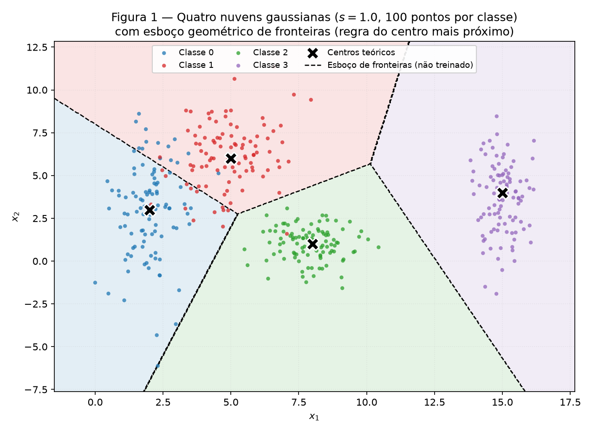
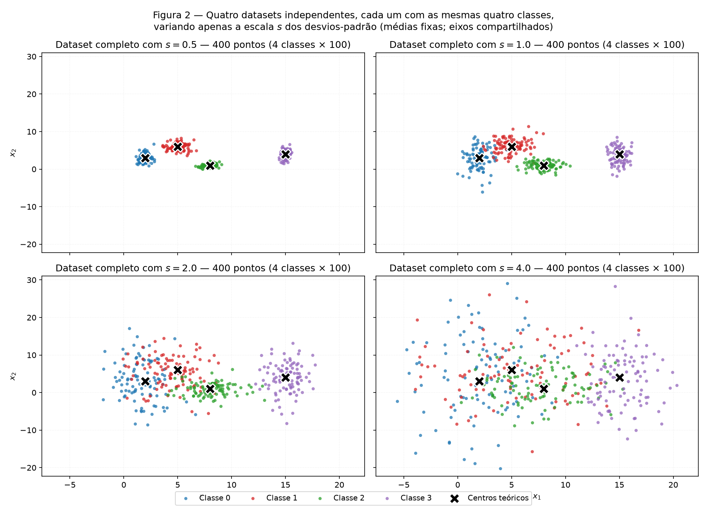
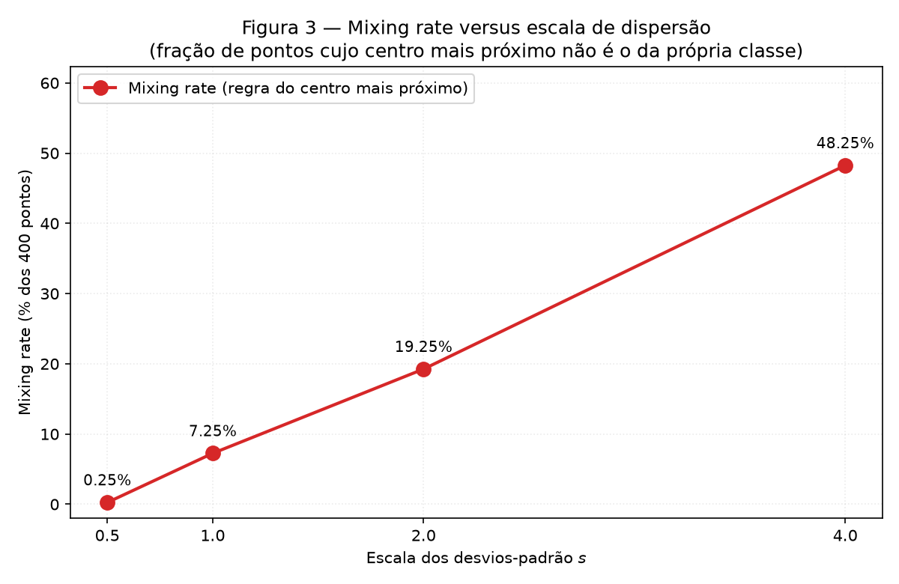
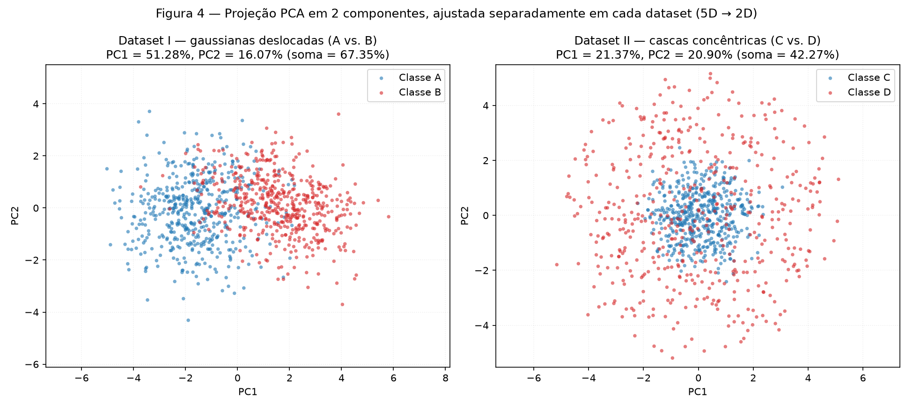
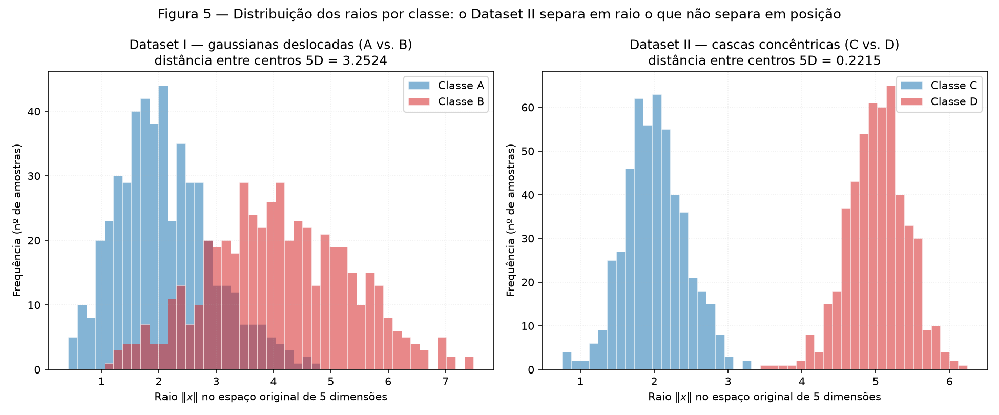
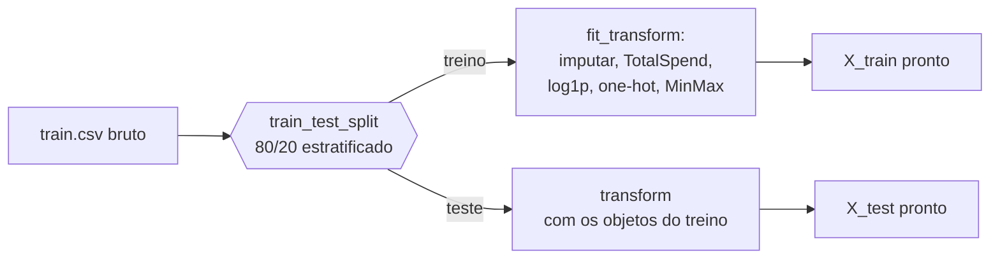
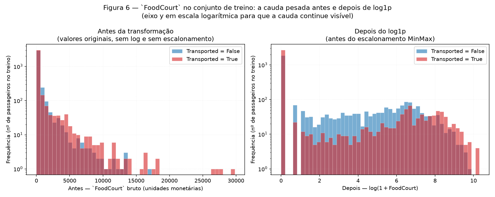

# 1. Data

!!! abstract "Enunciado"

    [Exercises → Data](https://insper.github.io/ann-dl/){:target='_blank'}

!!! info "Como reproduzir"

    Todos os números deste relatório saem de uma única execução. A partir da raiz
    do repositório:

    ```bash
    python -m pip install -r requirements.txt
    python docs/exercises/data/code/run_all.py
    python docs/exercises/data/code/validate.py
    mkdocs build --strict
    ```

    `run_all.py` regenera as seis figuras em `figures/`, imprime todas as métricas
    no terminal e as grava em `results/metrics.json`. `validate.py` confere as 21
    verificações técnicas exigidas pelo enunciado (contagens, formas, ausência de
    vazamento, `NaN` e infinitos, figuras e integridade do relatório).

## Estrutura do código

O código vive em [`code/`](https://github.com/giovannyjvr/exercicio-redes/tree/main/docs/exercises/data/code)
como arquivos reais e é incluído neste relatório pelo próprio arquivo, via `--8<--`:
relatório e repositório nunca saem de sincronia.

| Arquivo | Papel |
|---|---|
| `run_all.py` | Ponto de entrada único. Cria a semente e executa os três exercícios em ordem fixa. |
| `common.py` | Caminhos, backend gráfico, salvamento das figuras e a regra do centro mais próximo. |
| `exercise1_point_clouds.py` | Exercise 1 — nuvens 2D, `r_ij` e *mixing rate*. |
| `exercise2_high_dim.py` | Exercise 2 — gaussianas 5D, cascas concêntricas e PCA. |
| `exercise3_spaceship_titanic.py` | Exercise 3 — pré-processamento do Spaceship Titanic. |
| `validate.py` | Verificações técnicas exigidas pelo enunciado. |

O `train.csv` usado no Exercise 3 está versionado em
[`data/train.csv`](https://github.com/giovannyjvr/exercicio-redes/blob/main/docs/exercises/data/data/train.csv),
para que a análise rode a partir de um clone limpo. É o arquivo rotulado da
competição, com 8693 linhas e as 14 colunas oficiais; `load_dataset` confere o
esquema antes de prosseguir e falha com uma mensagem explícita se o arquivo não
estiver lá.

!!! warning "Uma semente, um fluxo"

    A semente é criada **uma única vez**, em `run_all.py`, como
    `rng = np.random.default_rng(42)`, e o **mesmo objeto** é passado a cada função
    que gera dados. Ela nunca é reinicializada entre exercícios ou entre escalas —
    é por existir um único fluxo, sempre na mesma ordem, que os números abaixo são
    reprodutíveis. Por isso `run_all.py` é o único arquivo com bloco `__main__`:
    rodar um exercício isolado consumiria outro trecho da sequência aleatória.

    Duas APIs do scikit-learn não aceitam um `Generator` do NumPy e só entendem um
    inteiro: `train_test_split` e `PCA`. Nelas a mesma semente reaparece como
    `random_state=42`. (No `PCA`, para esta forma de matriz o solver escolhido é o
    denso, que é determinístico — o parâmetro está lá por explicitude.)

??? note "`run_all.py` — ponto de entrada"

    ``` { .python .copy .select linenums='1' title="docs/exercises/data/code/run_all.py" }
    --8<-- "docs/exercises/data/code/run_all.py"
    ```

??? note "`common.py` — infraestrutura compartilhada"

    ``` { .python .copy .select linenums='1' title="docs/exercises/data/code/common.py" }
    --8<-- "docs/exercises/data/code/common.py"
    ```

## Exercise 1

### A — Generate the clouds

**Abordagem.** Quatro classes gaussianas de covariância diagonal em 2D, 100 pontos
cada, totalizando **400 pontos**. As médias e os desvios são exatamente os do
enunciado; a amostragem é `rng.normal(loc=mean, scale=std, size=(100, 2))`.

| Classe | $\mu$ | $\sigma$ | $\bar\sigma = (\sigma_x + \sigma_y)/2$ |
|---|---|---|---|
| 0 | $(2.0,\ 3.0)$ | $(0.8,\ 2.5)$ | 1.6500 |
| 1 | $(5.0,\ 6.0)$ | $(1.2,\ 1.9)$ | 1.5500 |
| 2 | $(8.0,\ 1.0)$ | $(0.9,\ 0.9)$ | 0.9000 |
| 3 | $(15.0,\ 4.0)$ | $(0.5,\ 2.0)$ | 1.2500 |

O dataset deste item é o mesmo dataset de escala $s = 1.0$ do item B — a mesma
amostra, gerada uma única vez. Isso evita duplicar lógica e garante que a Figura 1
e o painel $s = 1.0$ da Figura 2 mostrem exatamente os mesmos 400 pontos.


/// caption
**Figura 1** — As quatro classes em $s = 1.0$, com os centros teóricos marcados
($\times$) e o **esboço de fronteiras** pedido no item C.
///

O esboço de fronteiras da Figura 1 é a partição de **centro mais próximo** dos
quatro centros teóricos. Cada fronteira é a mediatriz entre dois centros, de modo
que o conjunto é linear por partes. **Nenhum classificador foi treinado**: é uma
construção puramente geométrica, apresentada como um traçado *plausível* do que
uma rede treinada poderia aprender, não como resultado de um ajuste.

**Verificações executadas pelo código:** as quatro amostras têm forma $(400, 2)$ e
contagem $[100, 100, 100, 100]$ por classe.

### B — More or less spread out

**Abordagem.** Quatro datasets **independentes e completos**, cada um com as mesmas
quatro classes e 400 pontos. Entre eles muda apenas o fator de escala
$s \in \{0.5,\ 1.0,\ 2.0,\ 4.0\}$, que multiplica **somente os desvios**; as médias
ficam fixas.


/// caption
**Figura 2** — Os quatro datasets completos, um por escala, com **limites de eixo
compartilhados**. Cada painel é um dataset inteiro (4 classes × 100 pontos), não
uma classe diferente.
///

#### Separation ratio em $s = 1$

$$
r_{ij} = \frac{\lVert \mu_i - \mu_j \rVert}{\bar\sigma_i + \bar\sigma_j},
\qquad
\bar\sigma_k = \frac{\sigma_{k,x} + \sigma_{k,y}}{2}
$$

Calculado sobre os **parâmetros teóricos** do enunciado, não sobre estimativas
amostrais — são os seis pares distintos:

| $i$ | $j$ | $\lVert \mu_i - \mu_j \rVert$ | $\bar\sigma_i$ | $\bar\sigma_j$ | $r_{ij}$ |
|---:|---:|---:|---:|---:|---:|
| 0 | 1 | 4.2426 | 1.6500 | 1.5500 | **1.3258** |
| 0 | 2 | 6.3246 | 1.6500 | 0.9000 | 2.4802 |
| 0 | 3 | 13.0384 | 1.6500 | 1.2500 | 4.4960 |
| 1 | 2 | 5.8310 | 1.5500 | 0.9000 | 2.3800 |
| 1 | 3 | 10.1980 | 1.5500 | 1.2500 | 3.6422 |
| 2 | 3 | 7.6158 | 0.9000 | 1.2500 | 3.5422 |

- **Menor $r_{ij}$ em $s = 1$: $r_{01} = 1.3258$**, no par **classe 0 × classe 1**.
  São as duas nuvens mais próximas ($\lVert \mu_0 - \mu_1 \rVert = 4.2426$) e, ao
  mesmo tempo, as duas mais dispersas ($\bar\sigma_0 + \bar\sigma_1 = 3.2000$).
- **Em $s = 2$ esse valor cai para $r_{01} = 0.6629$.** Não foi preciso gerar
  dados novos: as médias não dependem de $s$ e os desvios são proporcionais a $s$,
  logo $r_{ij}(s) = r_{ij}(1)/s$ exatamente. Aqui, $1.3258 / 2 = 0.6629$.

O limiar interessante é $r_{ij} = 1$: abaixo dele a distância entre os centros é
*menor* que a soma das dispersões médias das duas classes, ou seja, as nuvens se
interpenetram em vez de apenas se tocarem.

#### Mixing rate por escala

Para cada ponto de cada dataset: calcula-se a distância aos quatro centros
teóricos, toma-se o mais próximo e compara-se a classe desse centro com a classe
verdadeira. A *mixing rate* é a fração de classificações **geométricas** erradas —
de novo, sem treinar modelo algum.

| Escala $s$ | Mixing rate (fração) | Mixing rate (%) | Pontos errados (de 400) |
|---:|---:|---:|---:|
| 0.5 | 0.0025 | 0.25 % | 1 |
| 1.0 | 0.0725 | 7.25 % | 29 |
| 2.0 | 0.1925 | 19.25 % | 77 |
| 4.0 | 0.4825 | 48.25 % | 193 |


/// caption
**Figura 3** — *Mixing rate* em função da escala $s$, com marcador e rótulo
percentual nos quatro valores medidos.
///

??? note "`exercise1_point_clouds.py` — código do Exercise 1"

    ``` { .python .copy .select linenums='1' title="docs/exercises/data/code/exercise1_point_clouds.py" }
    --8<-- "docs/exercises/data/code/exercise1_point_clouds.py"
    ```

### C — Analysis

#### A partir de qual escala as fronteiras lineares deixam de resolver o problema

**A quebra acontece em $s = 2$, e em $s = 4$ o problema está essencialmente
perdido.** O argumento junta as duas métricas:

- Em $s = 0.5$ ($r_{01} = 2.6517$) as nuvens são quatro ilhas isoladas: **0.25 %**
  de mistura, um único ponto fora do lugar. Retas resolvem com folga.
- Em $s = 1$ ($r_{01} = 1.3258$) as classes 0 e 1 já se tocam na diagonal entre
  seus centros, e a mistura sobe para **7.25 %**. Ainda é um problema
  confortavelmente linear: quase todo o erro se concentra numa faixa estreita entre
  duas classes vizinhas, visível na Figura 1.
- Em $s = 2$ o menor separation ratio cruza o limiar crítico: $r_{01} = 0.6629 < 1$.
  A distância entre $\mu_0$ e $\mu_1$ passa a ser **menor** que a soma das
  dispersões médias das duas classes — elas deixam de se tocar e passam a ocupar o
  mesmo espaço. A mistura quase triplica, para **19.25 %**: cerca de um ponto em
  cada cinco cai do lado errado de *qualquer* fronteira construída a partir dos
  centros. É aqui que "separável por retas" deixa de ser uma descrição razoável.
- Em $s = 4$ ($r_{01} = 0.3315$) restam **48.25 %** de mistura. O acerto por
  adivinhação em quatro classes balanceadas seria 25 %, ou seja, 75 % de erro: a
  geometria ainda carrega alguma informação, mas metade do conjunto está do lado
  errado e a Figura 2 mostra uma nuvem única com quatro cores embaralhadas.

**O que acontece com o menor $r_{ij}$ nessa escala.** Ele passa de 1.3258 para
0.6629, isto é, **cruza o valor 1 pela primeira vez**. Como $r_{ij}(s)$ decai
exatamente como $1/s$ e o par 0–1 já era o mais apertado em $s = 1$, é ele que
dita o momento da quebra — o desempenho de um separador linear multiclasse é
limitado pelo par de classes *mais* sobreposto, não pela média dos pares.

#### Uma reta só versus um conjunto de fronteiras lineares

São coisas diferentes, e a distinção é o ponto do exercício.

**Uma única reta não consegue separar quatro classes, em escala nenhuma — nem
mesmo em $s = 0.5$, onde as nuvens estão perfeitamente isoladas.** O motivo é
combinatório, não estatístico: uma reta corta o plano em exatamente dois
semiplanos, logo produz no máximo dois rótulos. Com quatro classes, três delas
seriam obrigatoriamente colocadas juntas. Nenhuma quantidade de separação entre as
nuvens conserta isso.

**Um conjunto de fronteiras lineares resolve.** É exatamente o que a Figura 1
mostra: quatro regiões delimitadas por trechos de reta. Em termos de rede neural, é
o que uma camada de saída com quatro neurônios lineares (um por classe, decisão por
$\arg\max$) produz — cada par de classes contribui com uma fronteira, e o resultado
é uma partição linear por partes. Contar as fronteiras: com quatro classes há
$\binom{4}{2} = 6$ pares, e a partição da Figura 1 realiza as fronteiras que de fato
aparecem entre regiões vizinhas. O custo é apenas o número de parâmetros; a
capacidade de representação continua sendo a de um modelo linear.

#### Como a sobreposição amplia a região de erro inevitável

Quando duas nuvens se aproximam em relação à sua dispersão — que é precisamente o
que $r_{ij}$ pequeno significa — surge uma faixa em torno da fronteira onde pontos
das duas classes coexistem. Dentro dessa faixa **qualquer** fronteira, linear ou
não, erra: em cada ponto da região há massa de probabilidade das duas classes, e
uma decisão determinística tem de escolher uma delas.

O que muda com $s$ é a **largura** dessa faixa. Como os centros são fixos e os
desvios crescem com $s$, a zona de convivência engorda proporcionalmente a $s$
enquanto a distância entre centros fica parada — é a mesma razão $1/s$ que aparece
em $r_{ij}$. A Figura 3 mede esse efeito diretamente: de $s = 0.5$ a $s = 4$ o erro
geométrico vai de 0.25 % a 48.25 %. Aumentar a capacidade do modelo não recupera
esses pontos; a informação para separá-los simplesmente não está nas features.

#### Separabilidade da população, da amostra e da figura

O enunciado fala em "separável por retas", e vale distinguir três coisas que o
desenho tende a confundir:

1. **População.** Gaussianas têm suporte infinito: para qualquer par de classes e
   qualquer escala, inclusive $s = 0.5$, existe probabilidade estritamente positiva
   de um ponto da classe 0 cair dentro da região da classe 1. **Nenhuma fronteira
   atinge erro zero populacional**, e o erro de Bayes é maior que zero em todas as
   quatro escalas.
2. **Amostra finita.** É o que as tabelas acima medem. Com 400 pontos e $s = 0.5$,
   observamos 1 ponto mal classificado (0.25 %) — a amostra é *quase* separável
   pela partição de centro mais próximo, embora a população não seja. Esse número
   depende da amostra e da semente; com outra semente ele oscila.
3. **Leitura visual/geométrica.** É a que o exercício pretende: olhando a Figura 2,
   em $s = 0.5$ e $s = 1$ enxergam-se quatro grupos e é natural traçar retas entre
   eles; em $s = 4$ não se enxerga grupo nenhum.

Quando este relatório diz que em $s = 2$ os dados "deixam de ser razoavelmente
separáveis por retas", a afirmação é sobre (2) e (3) — a amostra finita e a leitura
geométrica —, não sobre (1), que é falsa em qualquer escala.

## Exercise 2

### A — Dataset I: shifted Gaussians

**Abordagem.** 500 amostras de cada classe em 5 dimensões, via
`rng.multivariate_normal`. A classe A está na origem com correlação positiva entre
as duas primeiras features; a classe B está deslocada de 1.5 em todos os eixos, tem
variâncias maiores (1.5 contra 1.0) e correlação **negativa** entre as duas
primeiras features.

$$
\mu_A = (0,0,0,0,0), \qquad \mu_B = (1.5,\ 1.5,\ 1.5,\ 1.5,\ 1.5)
$$

$$
\Sigma_A =
\begin{pmatrix}
1.0 & 0.8 & 0.1 & 0.0 & 0.0\\
0.8 & 1.0 & 0.3 & 0.0 & 0.0\\
0.1 & 0.3 & 1.0 & 0.5 & 0.0\\
0.0 & 0.0 & 0.5 & 1.0 & 0.2\\
0.0 & 0.0 & 0.0 & 0.2 & 1.0
\end{pmatrix}
\qquad
\Sigma_B =
\begin{pmatrix}
1.5 & -0.7 & 0.2 & 0.0 & 0.0\\
-0.7 & 1.5 & 0.4 & 0.0 & 0.0\\
0.2 & 0.4 & 1.5 & 0.6 & 0.0\\
0.0 & 0.0 & 0.6 & 1.5 & 0.3\\
0.0 & 0.0 & 0.0 & 0.3 & 1.5
\end{pmatrix}
$$

Aqui a informação de classe está na **posição**: os dois grupos ocupam regiões
diferentes do espaço.

### B — Dataset II: concentric shells

**Abordagem.** 500 amostras por classe, também em 5D, construídas em duas etapas:

1. **Direção.** Sorteia-se $v \sim \mathcal{N}(0, I_5)$ e normaliza-se
   $u = v / \lVert v \rVert$. Como a normal multivariada isotrópica é invariante a
   rotações, $u$ é uniforme sobre a esfera unitária de 5D. O código reamostra
   qualquer linha de norma zero antes de dividir — o evento tem probabilidade zero,
   mas dividir por zero devolveria `nan` silenciosamente.
2. **Raio.** Classe C: $\rho \sim \mathcal{N}(2.0,\ 0.4)$. Classe D:
   $\rho \sim \mathcal{N}(5.0,\ 0.4)$. O ponto final é $x = \rho \, u$.

Os raios **não** são convertidos para valor absoluto: isso truncaria a distribuição
especificada. Com $\rho$ a cinco desvios de zero, a fração de raios negativos é
desprezível, e nenhum apareceu nesta execução.

!!! note "Leitura de $\mathcal{N}(2.0,\ 0.4)$"

    O segundo parâmetro é lido como **desvio-padrão**, que é a assinatura de
    `Generator.normal`. Com desvio 0.4, as duas cascas ficam a 7.5 desvios uma da
    outra — a separação radial limpa que o exercício quer exibir. As estatísticas
    medidas confirmam a leitura: a classe C tem raio médio 2.0039 com desvio 0.4113,
    e a D, 5.0175 com desvio 0.4055.

Aqui a informação de classe está no **raio**, não na posição: as duas classes são
concêntricas.

**Verificações executadas pelo código:** ambos os datasets têm forma $(1000, 5)$
com 500 pontos por classe, e as direções sorteadas têm norma 1 com desvio máximo de
$2.2 \times 10^{-16}$ (o próprio épsilon da máquina).

### C — Visualize and compare

**Abordagem.** Para cada dataset, as duas classes são combinadas, um PCA de **duas
componentes** é ajustado **separadamente** naquele dataset, e os dados são
projetados. Também se mede, no **espaço original de 5 dimensões**, o centro
amostral de cada classe e a distância euclidiana entre eles.

#### Variância explicada

| Dataset | PC1 | PC2 | PC1 + PC2 |
|---|---:|---:|---:|
| I — gaussianas deslocadas | 0.5128 (51.28 %) | 0.1607 (16.07 %) | **0.6735 (67.35 %)** |
| II — cascas concêntricas | 0.2137 (21.37 %) | 0.2090 (20.90 %) | **0.4227 (42.27 %)** |

#### Distância entre os centros amostrais em 5D

| Dataset | Centros | $\lVert \bar{x}_1 - \bar{x}_2 \rVert$ |
|---|---|---:|
| I | A na origem, B em $\approx (1.5,\dots,1.5)$ | **3.2524** |
| II | C e D, ambos $\approx$ origem | **0.2215** |

Para referência, a distância teórica no Dataset I é
$\lVert \mu_B - \mu_A \rVert = 1.5\sqrt{5} = 3.3541$; o valor amostral 3.2524 é a
estimativa com 500 pontos por classe. No Dataset II a distância teórica é **zero**
(as duas classes têm média zero por simetria), e o 0.2215 medido é ruído de
amostragem finita.


/// caption
**Figura 4** — Projeção PCA em 2 componentes. **Esquerda:** Dataset I, onde as
classes se separam ao longo de PC1. **Direita:** Dataset II, onde a projeção revela
um anel — a classe C no miolo, a D na borda.
///


/// caption
**Figura 5** — Histogramas sobrepostos de $\lVert x \rVert$ no espaço original de
5D, com os mesmos bins dentro de cada comparação. **Esquerda:** Dataset I, raios
bastante sobrepostos. **Direita:** Dataset II, dois picos praticamente disjuntos.
///

| Dataset | Classe | Raio médio | Desvio | Faixa observada |
|---|---|---:|---:|---|
| I | A | 2.1019 | 0.8233 | [0.4228, 4.7968] |
| I | B | 4.0940 | 1.2354 | [1.0999, 7.4885] |
| II | C | 2.0039 | 0.4113 | [0.7522, 3.2796] |
| II | D | 5.0175 | 0.4055 | [3.4449, 6.2403] |

**Qual projeção preserva melhor a informação relevante à classificação?** A do
**Dataset I**. Duas leituras sustentam isso. Primeiro, ela retém mais variância
total: 67.35 % contra 42.27 %. Segundo — e mais importante —, na Figura 4 o eixo
PC1 do Dataset I é quase o eixo que separa as classes: os dois grupos aparecem
deslocados um em relação ao outro, e um corte vertical em PC1 já classificaria a
maior parte dos pontos. No Dataset II, ao contrário, **nenhuma reta** traçada sobre
a projeção separa as classes, porque a estrutura é anular; a informação sobrevive à
projeção (o anel está lá, bem visível), mas não numa forma que uma fronteira linear
saiba usar.

O contraste entre as variâncias explicadas tem uma explicação geométrica direta. No
Dataset II a nuvem é esfericamente simétrica: as cinco direções são
estatisticamente equivalentes, e não existe direção privilegiada para o PCA
encontrar — daí PC1 (21.37 %) e PC2 (20.90 %) serem praticamente iguais entre si e
próximos de $1/5 = 20\%$. O PCA maximiza variância, e nesse dataset a variância é
isotrópica.

??? note "`exercise2_high_dim.py` — código do Exercise 2"

    ``` { .python .copy .select linenums='1' title="docs/exercises/data/code/exercise2_high_dim.py" }
    --8<-- "docs/exercises/data/code/exercise2_high_dim.py"
    ```

### D — Analysis

#### Por que centros quase coincidentes e raios separados condenam o hiperplano

Um separador linear em 5D é
$f(x) = w^\top x + b$, e a decisão é o sinal de $f$. Essa função tem uma propriedade
decisiva: **ela é monótona ao longo da direção $w$**. Andando em linha reta na
direção de $w$, $f$ só cresce; na direção oposta, só decresce. Um hiperplano
portanto separa "de um lado" de "do outro lado" — e nada mais.

Agora olhe o que as medições dizem sobre o Dataset II:

- Os centros estão a **0.2215** um do outro — praticamente no mesmo lugar, contra
  3.2524 no Dataset I. Não existe direção $w$ ao longo da qual a classe D esteja
  "adiante" da C: qualquer que seja $w$, a projeção $w^\top x$ das duas classes tem
  média $\approx 0$, porque as duas nuvens são centradas na origem.
- Ao mesmo tempo, os raios são **quase disjuntos**: C fica em [0.7522, 3.2796] e D,
  em [3.4449, 6.2403]. As duas faixas nem se tocam nesta amostra.

Juntando: a classe D cerca a classe C por todos os lados. Escolhido qualquer
hiperplano, ele corta a casca externa em duas metades; a metade que ficar do mesmo
lado que o miolo C será classificada junto com C. Como o "lado de fora" existe em
todas as direções e o hiperplano só oferece dois lados, aproximadamente metade da
classe D cai do lado errado — **o desempenho de qualquer separador linear aqui
tende a 50 %, o mesmo do acaso.** É o inverso do Dataset I, onde os centros
separados dão exatamente a direção $w$ que funciona.

#### Por que mais dados não resolvem

Porque o obstáculo não é estatístico, é de **representação**. Mais amostras reduzem
a incerteza sobre os parâmetros, mas a estrutura permanece a mesma: as duas classes
continuam concêntricas, e a família de funções $\{w^\top x + b\}$ continua sem
conseguir expressar "longe do centro em qualquer direção".

Na verdade, mais dados **pioram** a estimativa ingênua. O 0.2215 medido entre os
centros é ruído amostral, e ele encolhe como $1/\sqrt{n}$: dobrando o número de
amostras, os centros ficam ainda mais coincidentes e o melhor $w$ fica ainda menos
definido. O erro do melhor separador linear converge para 50 %, ele não decresce.

A saída não é mais dados: é mudar a família de funções — uma camada escondida com
ativação não linear, ou uma feature nova que já contenha a informação radial.

#### Por que uma projeção PCA 2D misturada não prova inseparabilidade

Porque o PCA é uma **projeção linear escolhida sem olhar os rótulos**. Ele maximiza
variância retida, não separação entre classes; são objetivos diferentes, e uma
projeção pode descartar justamente a direção que separava. Além disso, no Dataset II
descemos de 5 dimensões para 2: as três dimensões descartadas carregam 57.73 % da
variância, e um par de classes bem separado em 5D pode chegar sobreposto em 2D.

Ver classes misturadas numa projeção é, portanto, **evidência inconclusiva**. A
demonstração precisa vir de uma medida no espaço original — e os resultados acima
mostram a assimetria nas duas direções:

- **Projeção misturada, classes separáveis.** É o caso do Dataset II. Na Figura 4
  nenhuma reta separa o anel, e ainda assim os histogramas de raio da Figura 5 —
  calculados em 5D, sem projetar nada — mostram faixas que não se tocam. A estrutura
  estava lá o tempo todo; a projeção linear é que não sabia exibi-la.
- **Projeção informativa.** É o caso do Dataset I, onde PC1 quase coincide com a
  direção que separa as classes. Mas isso é sorte da geometria, não garantia do
  método.

Em resumo: uma projeção 2D confusa prova que **aquela projeção** não separa, não que
os dados sejam inseparáveis. A conclusão correta sobre o Dataset II é a oposta da
que a Figura 4 sugere isoladamente — ele é separável, e por uma função muito simples.

#### A função que separa as cascas

A quantidade que distingue as classes do Dataset II é o raio, e ele se escreve em
função das entradas como

$$
g(x) \;=\; \sum_{i=1}^{5} x_i^2 \;=\; \lVert x \rVert^2 .
$$

A regra de decisão é um **limiar radial**:

$$
\hat{y}(x) =
\begin{cases}
\text{classe D} & \text{se } g(x) > \tau,\\
\text{classe C} & \text{caso contrário.}
\end{cases}
$$

Note que $g$ **não** é da forma $w^\top x + b$ — ela é quadrática, e é exatamente
essa não linearidade que resolve o problema. Uma rede com uma camada escondida
aproxima $g$ sem dificuldade; um perceptron de camada única, não. Em compensação, no
espaço transformado $z = g(x)$, de uma única dimensão, o problema volta a ser
linearmente separável por um limiar.

**Escolha do limiar.** Um valor ilustrativo é o ponto médio entre os raios médios
observados, $\tau^{1/2} = (2.0039 + 5.0175)/2 = 3.5107$, ou seja
$\tau = 12.3250$. Ele é uma **leitura das distribuições da Figura 5**, não um
parâmetro aprendido: qualquer valor no intervalo vazio entre as duas faixas —
$(3.2796,\ 3.4449)$ em raio — serviria igualmente. Aplicada aos 1000 pontos, essa
regra erra **0.10 %**, isto é, um único ponto: o da classe D com raio 3.4449, o
mais interno da casca externa, que cai logo abaixo do limiar escolhido. Deslocar
$\tau$ para dentro do intervalo vazio zeraria o erro nesta amostra — o que reforça
que o número não vem de um ajuste, mas da geometria.

## Exercise 3

### A — Get to know the data

**Abordagem.** Usa-se exclusivamente o `train.csv` **rotulado** da competição
[Spaceship Titanic](https://www.kaggle.com/competitions/spaceship-titanic/data),
versionado em `docs/exercises/data/data/train.csv`. O carregamento confere as 14
colunas oficiais antes de prosseguir, para não confundir o arquivo com o de outro
projeto. O dataset tem **8693 linhas × 14 colunas**.

**Objetivo da competição.** Prever, para cada passageiro da nave *Spaceship
Titanic*, se ele foi **transportado para outra dimensão** durante a colisão da nave
com uma anomalia no espaço-tempo. É uma classificação binária, avaliada em acurácia.

**A variável alvo.** `Transported` é booleana e indica exatamente isso: `True` se o
passageiro foi transportado para outra dimensão, `False` se permaneceu a bordo.

| Classe | Contagem | Percentual |
|---|---:|---:|
| `Transported = True` | 4378 | **50.36 %** |
| `Transported = False` | 4315 | 49.64 % |
| **Total** | **8693** | 100.00 % |

O problema é **praticamente balanceado** — a diferença entre as classes é de 63
passageiros. Isso simplifica o treinamento: acurácia é uma métrica honesta aqui, não
é preciso reponderar a *loss* nem reamostrar, e o *baseline* trivial (chutar sempre
a classe majoritária) acerta apenas 50.36 %.

#### Features numéricas e categóricas

| Tipo | Colunas |
|---|---|
| **Numéricas** | `Age`, `RoomService`, `FoodCourt`, `ShoppingMall`, `Spa`, `VRDeck` |
| **Categóricas** | `HomePlanet`, `CryoSleep`, `Destination`, `VIP` |
| **Identificadores / texto livre** (descartadas) | `PassengerId`, `Cabin`, `Name` |
| **Alvo** | `Transported` |

`CryoSleep` e `VIP` são booleanas, mas entram como categóricas: têm valores ausentes
e não possuem ordem numérica significativa.

#### Valores ausentes, por coluna

| Coluna | Ausentes | % do total |
|---|---:|---:|
| `CryoSleep` | 217 | 2.50 % |
| `ShoppingMall` | 208 | 2.39 % |
| `VIP` | 203 | 2.34 % |
| `HomePlanet` | 201 | 2.31 % |
| `Name` | 200 | 2.30 % |
| `Cabin` | 199 | 2.29 % |
| `VRDeck` | 188 | 2.16 % |
| `Spa` | 183 | 2.11 % |
| `FoodCourt` | 183 | 2.11 % |
| `Destination` | 182 | 2.09 % |
| `RoomService` | 181 | 2.08 % |
| `Age` | 179 | 2.06 % |
| `PassengerId` | 0 | 0.00 % |
| `Transported` | 0 | 0.00 % |

Doze das catorze colunas têm ausentes, sempre em torno de **2 %** — um padrão
notavelmente uniforme, típico de dado sintético com máscara aleatória. Nenhuma
coluna chega perto de um nível que justificasse descartá-la, e o alvo está completo,
então nenhuma linha precisa ser removida por falta de rótulo.

#### Estatísticas das colunas de gasto

Calculadas sobre o dataset completo, ignorando os ausentes:

| Coluna | Média | Mediana | Máximo |
|---|---:|---:|---:|
| `RoomService` | 224.69 | 0.00 | 14 327 |
| `FoodCourt` | 458.08 | 0.00 | 29 813 |
| `ShoppingMall` | 173.73 | 0.00 | 23 492 |
| `Spa` | 311.14 | 0.00 | 22 408 |
| `VRDeck` | 304.85 | 0.00 | 24 133 |

**Interpretação — assimetria e cauda pesada.** As cinco colunas contam a mesma
história, e ela é extrema: **a mediana é 0 em todas**, enquanto a média varia de 173
a 458. Duas conclusões diretas:

1. **Mais da metade dos passageiros não gastou nada** em cada serviço — é o que uma
   mediana igual a zero significa. Faz sentido no domínio: passageiros em
   `CryoSleep` estão hibernando e não consomem nada a bordo.
2. **A distribuição é fortemente assimétrica à direita, com cauda muito pesada.**
   Numa distribuição simétrica média e mediana coincidem; aqui a média é puxada para
   cima por uma minoria de passageiros de gasto altíssimo. Em `FoodCourt`, o máximo
   (29 813) é **65 vezes a média** e infinitamente maior que a mediana. A média não
   descreve um passageiro típico; ela é um artefato dos *outliers*.

É por isso que as decisões de pré-processamento do item C são as que são: a
imputação usa a **mediana** (a média seria arrastada pela cauda) e as colunas de
gasto passam por **`log1p`** antes do escalonamento. Sem o log, um MinMax comprimiria
99 % dos passageiros num intervalo minúsculo perto de $-1$ só para acomodar o
passageiro que gastou 29 813.

### B — Split before you transform

**Abordagem.** O `train_test_split` é a **primeira** operação depois de separar `X`
de `y`, e acontece sobre os dados **brutos** — antes de qualquer imputação,
encoding, transformação logarítmica ou escalonamento.

```python
X_train, X_test, y_train, y_test = train_test_split(
    X, y, test_size=0.20, stratify=y, random_state=42,
)
```

- **Proporção:** 80/20.
- **Estratificação:** por `Transported`.
- **Semente fixa:** `random_state=42` (o `train_test_split` não aceita um
  `Generator` do NumPy, só um inteiro).

#### Confirmação numérica da estratificação

| Conjunto | Amostras | `Transported = True` | Proporção |
|---|---:|---:|---:|
| Completo | 8693 | 4378 | **50.3624 %** |
| Treino | 6954 | 3502 | **50.3595 %** |
| Teste | 1739 | 876 | **50.3738 %** |

As três proporções batem até a segunda casa decimal — a maior diferença em relação
ao conjunto completo é de **0.011 ponto percentual**. Os tamanhos também conferem:
$6954 + 1739 = 8693$, e $1739 / 8693 = 20.005\ \%$.

#### Por que ajustar transformações antes do split causa data leakage

O conjunto de teste existe para estimar o desempenho em dados **que o modelo nunca
viu**. Se a mediana de imputação, as categorias do one-hot ou o mínimo e o máximo do
scaler forem calculados sobre o dataset inteiro, essas estatísticas carregam
informação das linhas de teste para dentro do treino — e a estimativa de
generalização deixa de ser honesta, porque o teste já influenciou a preparação.

O caso mais concreto aqui é o escalonamento. Se o `MinMaxScaler` visse o dataset
todo, ele usaria o máximo global de cada coluna; o conhecimento de "quanto gastou o
passageiro mais extremo do teste" entraria na escala aplicada ao treino. O efeito
prático é uma métrica de teste otimista, que não se confirma em produção — onde os
dados futuros, por definição, não estavam disponíveis para ajustar nada.

Por isso **todo** transformador deste relatório é ajustado com `fit` apenas no
treino e aplicado ao teste com `transform`.

### C — Preprocess

**Abordagem.** A ordem das sete etapas é a parte que importa, e está explícita na
função `preprocess`:



#### 1. Colunas descartadas

`Cabin`, `Name` e `PassengerId` saem antes de tudo. `PassengerId` e `Name` são
identificadores: não generalizam e, se codificados, dariam à rede uma forma de
memorizar passageiros. `Cabin` é texto estruturado (`deck/num/side`) que exigiria
*parsing* próprio e não foi pedido aqui.

#### 2. Imputação

| Tipo | Estratégia | Ajustada em | Valores aprendidos |
|---|---|---|---|
| Numéricas | mediana | só no treino | `Age` = 27.0; `RoomService`, `FoodCourt`, `ShoppingMall`, `Spa`, `VRDeck` = 0.0 |
| Categóricas | moda | só no treino | `HomePlanet` = `Earth`; `CryoSleep` = `False`; `Destination` = `TRAPPIST-1e`; `VIP` = `False` |

A **mediana** é a escolha certa para as numéricas justamente por causa da cauda
pesada documentada no item A: a média de `FoodCourt` no treino é 452.61, mas mais da
metade dos passageiros gastou 0. Imputar 452.61 inventaria um gasto alto para quem
provavelmente não gastou nada; imputar a mediana (0.0) reproduz o comportamento
típico. Para as categóricas, a **moda** é o análogo natural, e com apenas ~2 % de
ausentes o viés introduzido é pequeno.

#### 3. Feature engineering — `TotalSpend`

`TotalSpend` é a soma das cinco colunas de gasto, e é criada **depois da imputação**.
A ordem é deliberada e precisa ser defendida: se a soma fosse feita antes, um
passageiro com `Spa` ausente e gastos altos nas outras colunas produziria um total
**menor que o real** — ou `NaN`, dependendo de como a soma tratasse o ausente. Nos
dois casos o erro entraria disfarçado de valor válido, e nada a jusante o detectaria.
Somando depois, todas as cinco parcelas são números, e o total é sempre consistente
com elas.

A feature é útil porque a rede não precisa aprender a somar: "gastou alguma coisa a
bordo" é um sinal forte (e diretamente ligado a `CryoSleep`), e `TotalSpend` o
entrega pronto.

#### 4. Caudas pesadas — `log1p`

Aplica-se $\log(1 + x)$ às cinco colunas de gasto **e também a `TotalSpend`**.
Incluir o total é coerente: ele é uma soma de variáveis de cauda pesada, herda a mesma
assimetria e chega a valores ainda maiores, então precisa do mesmo tratamento.

- `log1p` em vez de `log` porque metade dos valores é exatamente 0, e $\log(0)$ é
  $-\infty$. Com `log1p`, $0 \mapsto 0$.
- O código **verifica que não há valores negativos** nessas colunas antes de
  transformar (um `log1p` de valor menor que $-1$ produziria `nan`). A verificação
  passou nos dois conjuntos.
- **Nunca** se aplica `log1p` ao alvo nem às colunas categóricas.

O efeito está na Figura 6: `FoodCourt` sai de uma faixa de 0 a 29 813 para uma de 0 a
$\approx 10.3$, e a cauda deixa de dominar a escala.

#### 5. One-hot encoding

As quatro categóricas viram colunas binárias com
`OneHotEncoder(handle_unknown="ignore", sparse_output=False)`, **ajustado só no
treino**. Isso gera 10 colunas: `HomePlanet` (3), `CryoSleep` (2), `Destination` (3),
`VIP` (2).

`handle_unknown="ignore"` é o que protege o `transform` do teste: uma categoria que
não tenha aparecido no treino vira uma linha de zeros em vez de quebrar a execução.
Neste dataset as categorias do teste são todas conhecidas, mas a proteção é a postura
correta — em produção, uma categoria inédita não pode derrubar o pipeline.

Usa-se one-hot, e não uma codificação inteira, porque `HomePlanet` e `Destination`
não têm ordem: codificar `Earth=0, Europa=1, Mars=2` faria a rede assumir que Europa
fica "entre" a Terra e Marte, o que é geometricamente falso.

#### 6. Escalonamento

Para as sete colunas numéricas (`Age`, os cinco gastos e `TotalSpend`) usa-se
**`MinMaxScaler(feature_range=(-1, 1))`**, ajustado só no treino.

A escolha é ditada pela ativação: a imagem de $\tanh$ é exatamente $(-1, 1)$, então
mapear as entradas para essa mesma faixa deixa todas as features na região onde a
derivada da $\tanh$ é significativa. Entradas com magnitudes grandes cairiam na
região saturada da curva, onde a derivada é quase zero e o gradiente praticamente não
flui — o treinamento fica lento ou trava.

As **colunas one-hot ficam de fora do scaler** e permanecem em $0/1$. Elas já estão
numa escala pequena e comparável, e reescalá-las só distorceria a interpretação de
"categoria ausente / presente".

??? note "`exercise3_spaceship_titanic.py` — código do Exercise 3"

    ``` { .python .copy .select linenums='1' title="docs/exercises/data/code/exercise3_spaceship_titanic.py" }
    --8<-- "docs/exercises/data/code/exercise3_spaceship_titanic.py"
    ```

### D — Verify and visualize


/// caption
**Figura 6** — `FoodCourt` **apenas no conjunto de treino**, separado por classe.
**Esquerda:** valores brutos, sem log e sem escalonamento. **Direita:** depois do
`log1p` e **antes** do escalonamento MinMax. O eixo $y$ está em escala logarítmica
nos dois painéis, senão a cauda ficaria invisível.
///

A comparação é feita sobre os dados de treino, nunca sobre o teste. No painel da
esquerda, praticamente toda a massa fica na primeira barra, perto de zero, e alguns
poucos passageiros se espalham até 29 813 — a figura é quase inútil como
visualização, o que é exatamente o problema. No painel da direita, depois do `log1p`,
a distribuição se abre: continua havendo um pico em 0 (os passageiros que não
gastaram nada, que o `log1p` mantém em 0), mas os demais se distribuem de forma
legível entre 1 e 10.

#### Verificações finais

| Verificação | Treino | Teste |
|---|---|---|
| `shape` da matriz de features | **(6954, 17)** | **(1739, 17)** |
| Nº de `NaN` | **0** | **0** |
| Nº de infinitos | **0** | **0** |
| Todas as colunas numéricas | sim | sim |
| Mínimo global | **−1.0000** | **−1.0000** |
| Máximo global | **1.0000** | **1.1383** |

**As 17 features finais**, nesta ordem: `Age`, `RoomService`, `FoodCourt`,
`ShoppingMall`, `Spa`, `VRDeck`, `TotalSpend`, `HomePlanet_Earth`,
`HomePlanet_Europa`, `HomePlanet_Mars`, `CryoSleep_False`, `CryoSleep_True`,
`Destination_55 Cancri e`, `Destination_PSO J318.5-22`, `Destination_TRAPPIST-1e`,
`VIP_False`, `VIP_True`.

São 7 numéricas escalonadas + 10 colunas one-hot. Treino e teste têm a mesma largura,
como precisam ter.

#### Sobre o máximo 1.1383 no teste

O teste **ultrapassa** $[-1, 1]$, e isso não é um defeito a esconder — é a
consequência esperada de não haver vazamento. O scaler foi ajustado **só no treino**,
então ele conhece apenas os extremos do treino; um passageiro do teste que gaste mais
que o maior gastador do treino é mapeado para além de $1$. Se o teste ficasse
perfeitamente dentro da faixa, isso seria sinal de que seus extremos participaram do
`fit` — ou seja, de vazamento.

O excesso é minúsculo e está localizado:

| Coluna | Faixa no treino | Faixa no teste |
|---|---|---|
| `ShoppingMall` | [−1.0000, 1.0000] | [−1.0000, **1.1383**] |
| `VRDeck` | [−1.0000, 1.0000] | [−1.0000, **1.0345**] |

São **2 células fora da faixa em 29 563** (0.0068 % da matriz de teste), uma em cada
coluna — dois passageiros. Todas as outras 15 features do teste ficam dentro de
$[-1, 1]$.

#### A faixa é compatível com `tanh`?

**Sim.** A imagem da $\tanh$ é $(-1, 1)$, e é aí que as entradas estão: o treino
ocupa exatamente $[-1, 1]$ e o teste, $[-1,\ 1.1383]$. Vale distinguir dois papéis
que a $\tanh$ desempenha, porque confundi-los é um erro comum:

- Como **ativação das camadas escondidas**, a $\tanh$ recebe $w^\top x + b$, não $x$.
  O que importa é que as entradas tenham magnitude modesta e comparável entre si,
  para que a pré-ativação inicial não caia na região saturada. Com tudo em
  $[-1, 1]$, isso está garantido.
- O valor 1.1383 **não causa problema**: $\tanh(1.1383) \approx 0.8138$, bem longe da
  saturação. O ponto em que a $\tanh$ satura de fato fica em torno de $|z| > 3$.

As colunas one-hot, em $0/1$, também estão dentro da faixa e na mesma ordem de
grandeza das numéricas — não há nenhuma feature dominando a escala das demais, que é
a condição prática que se quer garantir antes de treinar.

#### Qual decisão de pré-processamento terá mais impacto no treinamento

**A transformação `log1p` nas colunas de gasto.** Ela é a decisão que mais muda o que
a rede enxerga, e o motivo aparece quando se imagina o pipeline sem ela.

Sem o `log1p`, o `MinMaxScaler` teria que acomodar `FoodCourt` de 0 a 29 813 dentro
de $[-1, 1]$. Como a mediana é 0 e mais da metade dos passageiros gastou nada, o
resultado seria uma coluna em que **mais de 50 % dos valores ficam exatamente em
$-1$** e praticamente todos os demais se amontoam nos primeiros milésimos acima
disso — um passageiro que gastou 500 (acima da média!) seria mapeado para $-0.966$,
indistinguível de quem gastou 0 na precisão que importa para o gradiente. Toda a
variação informativa da coluna ficaria comprimida num intervalo de largura desprezível,
enquanto o único passageiro de 29 813 ocuparia sozinho o outro extremo. A rede
receberia uma feature que, na prática, só distingue "outlier" de "todo o resto".

Com o `log1p`, a mesma coluna passa a ocupar a faixa de 0 a $\approx 10.3$ **antes**
do escalonamento, e as diferenças entre gastos pequenos, médios e grandes sobrevivem
ao MinMax como diferenças perceptíveis — é o que os dois painéis da Figura 6 mostram
lado a lado. Gradientes informativos chegam a todas as features de gasto, e não
apenas às poucas linhas extremas.

As outras decisões importam menos por razões concretas: a imputação toca apenas ~2 %
das linhas; o one-hot é praticamente obrigatório (uma codificação inteira introduziria
uma ordem falsa, mas o número de categorias é pequeno); e a escolha entre MinMax e
padronização mudaria a escala, não a **forma** da distribuição — que é exatamente o
que o `log1p` conserta.

## Results summary

| # | Item | Your value |
|---:|---|---|
| 1 | Mixing rate at \(s = 0.5\) | 0.0025 — 0.25 % (1 de 400 pontos) |
| 2 | Mixing rate at \(s = 1.0\) | 0.0725 — 7.25 % (29 de 400 pontos) |
| 3 | Mixing rate at \(s = 2.0\) | 0.1925 — 19.25 % (77 de 400 pontos) |
| 4 | Mixing rate at \(s = 4.0\) | 0.4825 — 48.25 % (193 de 400 pontos) |
| 5 | Smallest \(r_{ij}\) at \(s = 1.0\), and which pair | \(r_{01} = 1.3258\), par classe 0 × classe 1 (em \(s = 2.0\) vale 0.6629) |
| 6 | Distance between centers — Dataset I | 3.2524 |
| 7 | Distance between centers — Dataset II | 0.2215 |
| 8 | Explained variance PC1 + PC2 — Dataset I | 0.6735 — 67.35 % (PC1 = 51.28 %, PC2 = 16.07 %) |
| 9 | Explained variance PC1 + PC2 — Dataset II | 0.4227 — 42.27 % (PC1 = 21.37 %, PC2 = 20.90 %) |
| 10 | Share of the positive class in `Transported` | 50.36 % (4378 de 8693 passageiros) |
| 11 | Mean and median of `FoodCourt` on the training set, before transforming | média = 452.6112, mediana = 0.0000 |
| 12 | Final `shape` of the training feature matrix | (6954, 17) |
| 13 | Minimum and maximum of the training and test sets after scaling | treino: mín. −1.0000, máx. 1.0000 — teste: mín. −1.0000, máx. 1.1383 |
